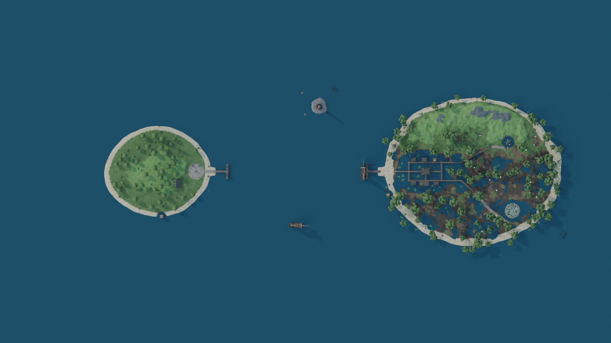
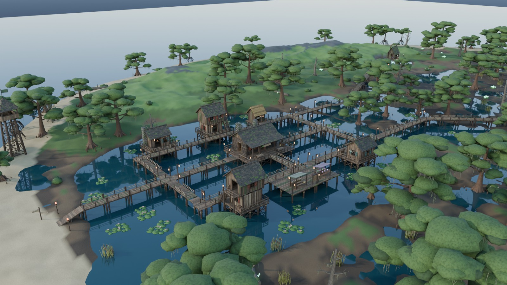
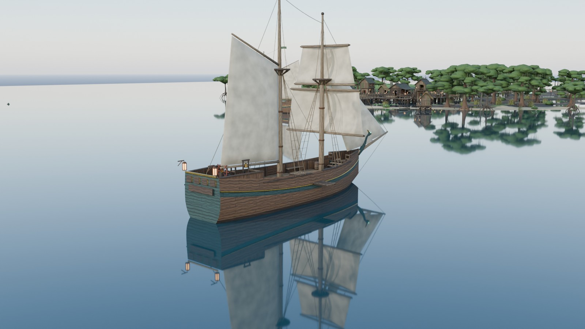
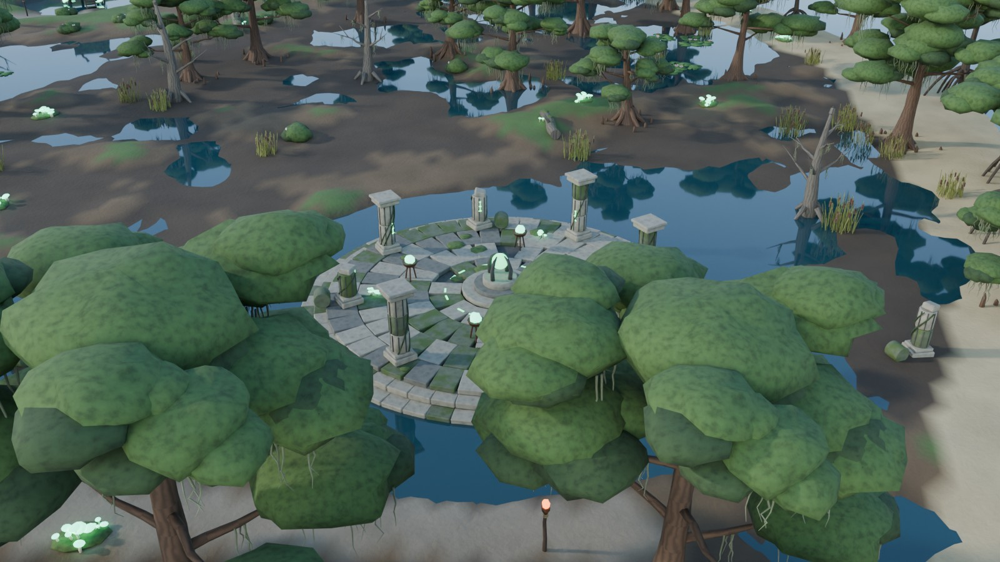
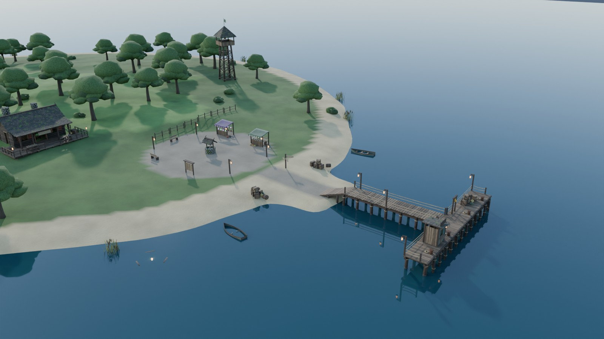

# 안개늪 군도 (Swamp Archipelago)

늪지대 섬, 항구섬, 등대 바위섬을 바다와 **연락선 「안개늪호」**로 잇는 Roblox 월드와,
처음부터 다시 짠 **서버 권위형 액션 전투 시스템**이 들어 있습니다.
건물, 배, 무기, 크리처는 모두 **Blender(Python `bpy`)로 절차적 모델링**했습니다.



| 늪 마을 | 연락선 |
|---|---|
|  |  |
| **늪의 사당 (보스 구역)** | **항구섬** |
|  |  |

---

## 1. 바로 실행하기

1. `build/SwampArchipelago.rbxl` 파일을 Roblox Studio에서 엽니다.
2. ▶ Play를 누릅니다. 서버가 처음 시작될 때 **지형(바다와 섬 3개)과 건물·식생 528개가 자동으로 생성**됩니다.
   생성에는 몇 초가 걸립니다.
3. 항구섬 광장에서 시작합니다. 부두에서 연락선을 타면 안개늪 섬으로 건너갑니다.

> 배포된 플레이스에서는 첫 서버가 뜰 때마다 생성하는 대신, Studio에서 **Swamp Tools ▸ 월드 생성**을 한 번 누르고
> 저장해 두는 방식을 권장합니다. 월드가 이미 있으면 서버는 다시 생성하지 않습니다.

### 조작법

| 입력 (키보드·마우스 / 패드) | 동작 |
|---|---|
| 좌클릭 / R2 | 약공격 (연타하면 콤보, 입력 버퍼 0.35초) |
| 좌클릭 길게 / R2 길게 | 충전 강공격 (최대 충전 시 피해 +60%, 강인도 파괴) |
| F 길게 / L2 | 방어. 맞기 직전 0.2초 안에 누르면 **패링**, 이후 반격 ×1.8 |
| Q / B | 구르기 (무적 시간 0.02~0.34초) |
| E / X, R / Y | 무기 기술 1, 2 |
| 1·2·3 / 방향 패드 | 무기 교체 (식칼 · 작살창 · 이끼 망치) |
| T / 휠 클릭 / R3 | 대상 고정 (락온) |
| H | 도움말 표시/숨김 |

모바일에서는 ContextActionService 터치 버튼이 자동으로 배치됩니다.

---

## 2. 무엇이 들어 있나

### 월드: 섬 3개와 바다
- **안개늪 섬 (Mistmire)**: 수상 가옥과 긴집이 있는 늪 마을, 널판 산책로와 밧줄 다리, 마녀의 오두막,
  폐허 아치, 그리고 보스가 기다리는 **늪의 사당**이 있습니다.
- **항구섬 (Harbor)**: 광장과 시장 좌판, 감시탑, 우물, 게시판, 연락선 부두가 있습니다.
- **등대 바위섬 (LighthouseRock)**: 등대(회전 광선)와 난파선이 있습니다.
- 섬 사이는 깊은 바다(Terrain Water)로 채웠습니다. 항로를 따라 부표가 떠 있고, 바다 끝에는 보이지 않는 경계벽이 있습니다.
- 구역마다 안개 농도, 색 보정, 물 색, 반딧불과 물안개 효과가 부드럽게 바뀌고 낮밤이 순환합니다.

### 에셋 53종 (Blender 절차적 모델링)
| 분류 | 에셋 |
|---|---|
| 건물 | StiltHouseA/B, StiltHutC, Longhouse, WitchHut, Watchtower, Lighthouse, MireShrine, MarketStallA/B, Well |
| 구조물 | FerryDock, Boardwalk(Straight/StraightB/Junction/Ramp), DeckPlatform, RopeBridge, Fence, RuinArch, RuinPillar |
| 소품 | LampPost, TorchPost, Campfire, Bench, Signpost, NoticeBoard, FishRack, CargoPile, Buoy, Rowboat, Shipwreck |
| 식생 | CypressA/B/C, Mangrove, BroadleafTree, DeadTree, FallenLog, SwampBush, Reeds, LilyPads, GlowMushrooms |
| 배 | Ferry (돛, 도선판, 조타륜, 선실, 랜턴) |
| 무기 | W_Bogcleaver, W_Harpoon, W_Mossmaul, W_BruteClub, W_WitchStaff |
| 크리처 | E_BogCrawler, E_MudBrute, E_BogWitch, E_MireLord |

각 에셋은 두 가지 형태로 나옵니다.
- **Part 버전** (`assets/rbxm`): Roblox 기본 파트로 재구성한 버전입니다. 플레이스에 이미 들어 있어서 바로 동작합니다.
- **MeshPart 버전** (`assets/fbx`): 원본 메시 그대로입니다. Studio로 임포트하면 더 정교한 모양이 됩니다 (4장 참고).

충돌은 보이지 않는 단순 충돌체(Block, Cylinder, 사다리용 Truss)로 따로 만들었습니다.
보이는 파트는 충돌하지 않으므로 복잡한 메시에 걸리는 일이 없고 물리 비용도 적습니다.

### 연락선 「안개늪호」
- 서버 시계(`GetServerTimeNow`)로 위치를 계산하는 **결정론적 시간표 운항**입니다.
  모든 클라이언트가 같은 위치를 보고, 네트워크로 배의 위치를 보낼 필요가 없습니다.
- 사다리꼴 속도 곡선(가속, 순항 30 stud/s, 감속), 정박 24초, 파도에 따른 상하·전후·좌우 흔들림,
  선회할 때 원심력에 따른 기울기를 반영합니다.
- 배 위의 플레이어는 **배의 움직임을 그대로 따라갑니다** (레이캐스트 + 프레임 간 CFrame 차이 적용).
  다른 플레이어도 배 기준 상대 좌표로 보정하기 때문에 배 위에서 미끄러져 보이지 않습니다.
- 도선판이 자동으로 내려가고 올라가며, 출항 전에 종이 울립니다. 선착장 안내 UI(다음 출항까지 남은 시간)와
  먼바다 구조 버튼(오래 수영하면 표시)도 있습니다.

### 전투 시스템 (전면 재구성)
- **서버 권위**: 클라이언트는 입력과 예측 연출만 담당하고, 판정·피해·상태는 모두 서버가 결정합니다.
  지연 보상은 서버가 위치 기록을 최대 0.35초 되감아서 판정합니다.
- **동작 단계**: 선딜(Windup), 판정(Active), 후딜(Recovery)이 있습니다. 콤보 입력 버퍼, 캔슬 창, 공격 중 이동 감속을 지원합니다.
- **방어 체계**: 정면 방어(반각 75도), 패링과 반격, 스태미나가 바닥나면 가드 브레이크,
  강인도(Poise)와 경직, 슈퍼아머를 지원합니다.
- **상태 이상**: 중독, 출혈(누적형), 화상, 둔화, 속박, 기절, 반격 기회, 격노.
- **치명타 / 백어택 / 반격 배율**, 투사체(작살과 마녀의 독구), 지연 광역기(바닥 예고 표시),
  넉백(`LinearVelocity`)도 있습니다.
- **무기 3종**
  - 늪지기 식칼: 4연격, 기술은 독날 베기와 회전베기
  - 작살창: 긴 사거리, 기술은 작살 투척(끌어당김)과 도약 찌르기
  - 이끼 망치: 강인도 파괴, 기술은 지면 강타와 돌진
- **적 4종**
  - 늪 크롤러: 떼로 다니며 독을 겁니다.
  - 진흙 거인: 슈퍼아머를 두르고 내려찍습니다.
  - 늪 마녀: 거리를 두고 원거리 공격을 합니다.
  - 보스 「늪의 군주 모르그라스」: 페이즈가 전환되고 소환수를 부르며, 전투 구역이 정해져 있습니다.
- **절차적 애니메이션**: Python으로 만든 포즈 클립 50개(`PoseLibrary`)를 Motor6D.Transform에 섞어서 재생합니다.
  애니메이션 에셋을 업로드할 필요가 없습니다. R15와 R6 모두 지원하고, 크리처는 절차적 보행을 합니다.
- **연출**: 히트스톱, 카메라 흔들림과 FOV 펀치, 타격 스파크, 피해 숫자, 무기 궤적,
  적 공격 예고(빨간 발광과 바닥 표시), 보스 체력바, 락온 표시, 사망과 부활 화면이 있습니다.

---

## 3. 폴더 구조

```
blender/                      Blender 파이프라인 (bpy)
  build_all.py                  모든 에셋 → FBX + Part JSON + 매니페스트 (+ 미리보기 렌더)
  swamplib/                     공용: 재질 팔레트, 지오메트리, 에셋 빌더, 렌더러
  assets/                       에셋별 모델링 스크립트 (건물/배/무기/크리처 …)
  level/layout.py               섬 높이맵·재질·배치·항로·스폰 설계 → Luau 데이터 생성
  level/render_level.py         레벨 전체 미리보기 렌더
tools/
  build_rbxm.luau               Part 버전 에셋 → assets/rbxm/*.rbxm (Lune)
  gen_asset_manifest.py         manifest.json → AssetManifest.luau
  poses/                        R15 FK, 포즈 클립 정의(clips.py), PoseLibrary.luau 생성, 포즈 시트
  check.sh                      rojo sourcemap + luau-lsp 엄격 분석
tests/                          Lune 테스트 (항로 수학, 전투 수식, 월드 데이터, 빌드된 플레이스 구조)
src/
  ReplicatedStorage/Shared/     Util, World(설정/지형코덱/데이터), Ferry, Combat(정의/수식/포즈)
  ServerScriptService/Server/   WorldService, FerryService, Combat/*, Enemies/*
  ServerStorage/SwampTools/     TerrainBuilder, WorldBuilder, AssetSetup, AssetManifest
  StarterPlayer/.../Client/     카메라·월드FX·환경음·연락선·락온·애니메이션·전투·HUD 컨트롤러
plugin/SwampTools.server.luau   Studio 툴바 (에셋 정리 / 월드 생성 / 배치 재생성 / 월드 삭제)
assets/
  fbx/        MeshPart용 FBX      rbxm/     Part 버전 템플릿      parts/  Part 변환 데이터
  blend/      원본 .blend 파일     previews/ 렌더 미리보기(JPEG) + poses/ 포즈 시트
build/        SwampArchipelago.rbxl (완성 플레이스), SwampTools.rbxmx (플러그인)
```

---

## 4. 작업 흐름

### Rojo로 개발
```bash
rokit install                                  # rojo, lune, luau-lsp, selene, stylua (버전 고정)
rojo serve default.project.json                # Studio의 Rojo 플러그인으로 연결
rojo build default.project.json -o build/SwampArchipelago.rbxl
rojo build plugin.project.json -o build/SwampTools.rbxmx
```

### 기존 게임에 합치기
`src/ReplicatedStorage/Shared/World/WorldConfig.luau` 한 파일만 고치면 됩니다.
- `Islands`: 섬마다 켜고 끌 수 있습니다. 기존 게임에 이미 있는 섬은 `false`로 두세요.
- `Offset`: 군도 전체를 옮깁니다. 지형 격자 때문에 4의 배수로 맞춰집니다.
- `BuildOnServerStart`, `BuildTerrain`, `BuildPlacements`, `CreateSpawnLocations`, `SeaWalls`, `ApplyLighting`
- `DayNight`, `Water`, `Zones`(구역별 분위기), `SignTexts`와 `NoticeText`(표지판 문구)
- `Sounds`, `Zones.*.AmbientSound`: 업로드한 오디오 ID(`rbxassetid://…`)를 넣으면 재생되고, 비워 두면 무음입니다.

연락선은 `Shared/Ferry/FerryConfig.luau`(속도, 정박 시간, 흔들림, 안내 거리)에서,
전투는 `Shared/Combat/CombatConfig.luau`(체력, 스태미나, 패링 창, 무적 시간, 지연 보상 …)에서 조정합니다.

### MeshPart(고품질 메시)로 교체
1. Studio ▸ 3D Importer(또는 Asset Manager 일괄 임포트)로 `assets/fbx/*.fbx`를 가져옵니다. 위치는 상관없습니다.
2. **Swamp Tools ▸ 에셋 정리**를 누릅니다. 명령창에서 `require(game.ServerStorage.SwampTools.AssetSetup).Run({ Rebuild = true })`를 실행해도 됩니다.
   - 이름(`<에셋>__<재질키>`)으로 MeshPart를 찾고, 매니페스트에 따라 크기·위치·재질·색을 복원합니다.
     임포트 단위(stud/m)가 달라도 복원됩니다.
   - Part 버전의 충돌체, 마커, 조명을 옮겨 담아 `SwampAssetsMesh` 폴더에 템플릿을 만듭니다.
     월드와 연락선은 메시 버전이 있으면 그것을 우선 사용합니다.
   - 되돌리려면 `AssetSetup.Revert()`를 실행합니다.

플러그인 설치: `build/SwampTools.rbxmx`를 Studio의 Plugins 폴더에 복사하면 됩니다.

### Blender 파이프라인 (에셋과 레벨을 고치고 다시 만들기)
```bash
pip install bpy==5.0.1 numpy pillow            # 또는 Blender 앱:  blender -b -P blender/build_all.py -- ...
python blender/build_all.py                     # 전체 에셋: FBX + Part JSON + manifest.json
python blender/build_all.py --only WitchHut --render --save-blend   # 한 개만 + 미리보기 + .blend
python blender/level/layout.py                  # 섬/배치/항로 → src/.../World/Generated/*.luau
python blender/level/render_level.py --save-blend                   # 레벨 미리보기
lune run tools/build_rbxm.luau                  # Part 버전 템플릿 재생성
python tools/gen_asset_manifest.py              # AssetManifest.luau 갱신
python tools/poses/gen_luau.py                  # 포즈 클립 → PoseLibrary.luau
python tools/poses/viz.py                       # 포즈 확인용 시트 (assets/previews/poses)
```
- 좌표 변환: Blender (x, y, z) → Roblox (x, z, −y). 에셋의 정면은 Blender +Y가 Roblox LookVector입니다.
- 에셋 안의 빈 객체(Empty) 마커(`M_*`, 크리처 관절 `J_*`)는 Roblox Attachment로 내보냅니다.
  문, 좌석, 불, 등불, 표지판 문구, 도선판 경첩 같은 기능은 이 마커를 기준으로 붙습니다.

### 검증
```bash
./tools/check.sh              # luau-lsp 엄격(strict) 타입 분석 — 오류 0
lune run tests/run.luau       # 62개 테스트 (항로 수학, 전투 수식, 월드 데이터, 빌드된 플레이스 구조)
```

---

## 5. 확장하기

| 하고 싶은 것 | 고칠 곳 |
|---|---|
| 무기 추가 | `Combat/WeaponDefs.luau`(무기), `MoveDefs.luau`(동작), `tools/poses/clips.py`(포즈) → `gen_luau.py`, `blender/assets/weapons.py`(모델) |
| 적 추가 | `Combat/EnemyDefs.luau` (스탯, AI 거리, 기술 가중치, 보스 페이즈), `blender/assets/creatures.py`, `layout.py`의 스폰 |
| 동작 수치 | `MoveDefs.luau`: 선딜·판정·후딜, 피해, 강인도 피해, 판정 범위(구·부채꼴·캡슐), 상태 이상, 넉백, 슈퍼아머 |
| 건물 배치 | `blender/level/layout.py` → `layout.py` 실행 → Studio에서 **배치 재생성** |
| 상태 이상 | `Combat/StatusDefs.luau` |

---

## 6. 알려진 제약

- 이 저장소의 코드는 luau-lsp 엄격 분석, Lune 테스트, Blender 재구성으로 검증했습니다.
  **실제 Roblox 엔진에서 실행해 보지는 못했습니다.** 처음 실행할 때 출력(Output) 창을 확인해 주세요.
  - 지형 생성은 `WriteVoxelChannels`를 먼저 쓰고, 실패하면 `WriteVoxels`로 자동 전환합니다.
- 효과음과 환경음 ID는 비워 두었습니다. 저작권 문제가 없는 오디오를 업로드해서 `WorldConfig.Sounds`에 넣어 주세요.
- 참고 자료로 주신 OneNote 링크는 이 작업 환경의 네트워크 정책 때문에 열 수 없었습니다.
  늪지대 디자인은 일반적인 늪 생태(사이프러스와 맹그로브, 수상 가옥, 부들, 수련, 반딧불, 물안개)를 바탕으로 직접 설계했습니다.
  자료를 공유해 주시면 거기에 맞춰 조정하겠습니다.
